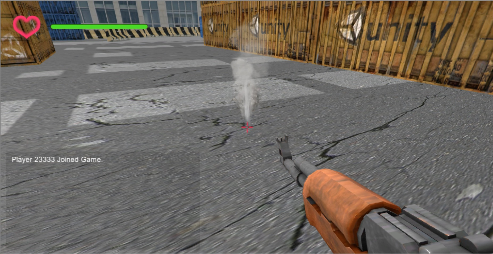

# Multiplayer-FPS

Game FPS menggunakan Unity3D

## Persyaratan

[Unity 2020.3.4f1 (LTS)](https://unity.cn/release-notes/lts/2020/2020.3.4f1)

## Logic dan Fungsionalitas Game

* Panel Login
  * Masukkan **player name** dan **room name** yang kamu ingin bergabung
  * Klik tombol **'join or create room'** untuk bergabung room / membuat room baru
  * Status koneksi ditampilkan pada pojok kiri bawah layar
    

* Game Interface
  * **Player's HP** Berada di pojok kiri atas layar
  * **message panel** berada di pojok kiri bawah, which shows status of other players (e.g. dead or respawn) yang menunjukkan status dari pemain lain (contoh : dead atau respawn)
  * Sebuah **gun (AK-47)** selalu ditampilkan di pojok kanan bawah didepan setiap hal yang dilihat
  * Sebuah **crosshair** selalu berada ditengah layar
  </img>

* Player models
  * Semua Model original dan animasinya dapat ditemukan di **[Mixamo](https://www.mixamo.com/)**, yang merupakan situs web Game Model website yang dijalankan oleh Adobe
  * There are three types of player Ada tiga tipe model player **models**:
    * **Policeman**: sebuah model mirip polisi dengan kulit kuning
    * **RobotX**: sebuah model mirip robot dengan kulit merah muda gelap
    * **RobotY**: sebuah model mirip robot dengan kulit biru tua
    * </img> </img> </img>

  * **Animasi**:
    * **Walk** menuju 4 arah yang berbeda
    * **Run** menuju 4 arah yang berbeda
    * **Jump** tanpa mempengaruhi tubuh bagian atas (**didapatkan dengan unity3d body mask**)
    * **Shoot** tanpa mempengaruhi tubuh bagian bawah (**didapatkan dengan unity3d body mask**)
    * **Unity Blend Tree**
      * Hal ini membuat pemain berjalan atau berlari lebih alami. Ini menggunakan fungsi interpolasi untuk memetakan kombinasi input pengguna yang berbeda ke animasi yang berbeda.
      * 

  * **State Machine**
    * Ada beberapa lapisan di state machine pemain. 
    * </img>
    * </img>
    * </img>
    * </img>

* Pergerakan Pemain
  * Berjalan && Berlari && Membidik
    * </img>
    * </img>
    * </img>
    * </img>
  * Melompat
    * </img>
  * Mati/Dead
    * </img>
    * </img>

* Model Senjata
  * Model senjata original (AK-47) berasal dari Unity Assets Store
  * **Animasi menembak ditambah** by setting keyframes in unity3d animation panel dengan mengatur keyframe di panel animasi unity3d
  

* Jaringan
  * Game ini menggunakan **Photon Unity Networking 2**, yang merupakan model jaringan yang bagus dari Unity Assets Store

* Efek Peluru
  * Peluru yang mengenai material yang berbeda akan menyebabkan efek yang berbeda
    * Kayu
    </img>
    * Tanah
    </img>
    * Besi
    </img>
    * Beton
    </img>
    * Air
    </img>

* Animasi Pintu
  * Pintu akan terbuka secara otomatis ketika ada seseorang di dekatnya dan menutup ketika tidak ada orang di sekitar
  * Sebelum
  </img>
  * Sesudah
  </img>

## Scripts

* **CameraRotation.cs**
  * Memutar scene camera di setiap frame yang diperbarui
* **DoorAnimtion.cs**
  * Mengontrol animasi pintu dan mendeteksi jika pemain masuk atau keluar dari area pemicu pintu
* **FpsGun.cs**
  * Mengontrol senjata dalam tampilan orang pertama, terutama untuk menembak
* **TpsGun.cs**
  * Mengontrol senjata dalam tampilan orang ketiga (direplikasi di jaringan), terutama mengubah dan efek partikel
* **IKControl.cs**
  * Memastikan model memegang senjata terlepas dari gerakan atau rotasi
* **ImpactLifeCycle.cs**
  * Menghancurkan objek peluru setelah beberapa detik untuk menghemat waktu dan memori CPU
* **NameTag.cs**
  * Menampilkan nama pemain lain di atas kepala mereka
* **NetworkManager.cs**
  * Mengontrol seluruh koneksi jaringan
* **PlayerHealth.cs**
  * Menghitung dan memperbarui poin kesehatan setiap pemain
* **PlayerNetworkMover.cs**
  * Menyinkronkan posisi pemain di antara klien yang berbeda

### Input Devices

* Mouse dan keyboard
  * Tradisional
  * Murah dan mudah untuk digunakan

*  </img></img>  </img></img>

